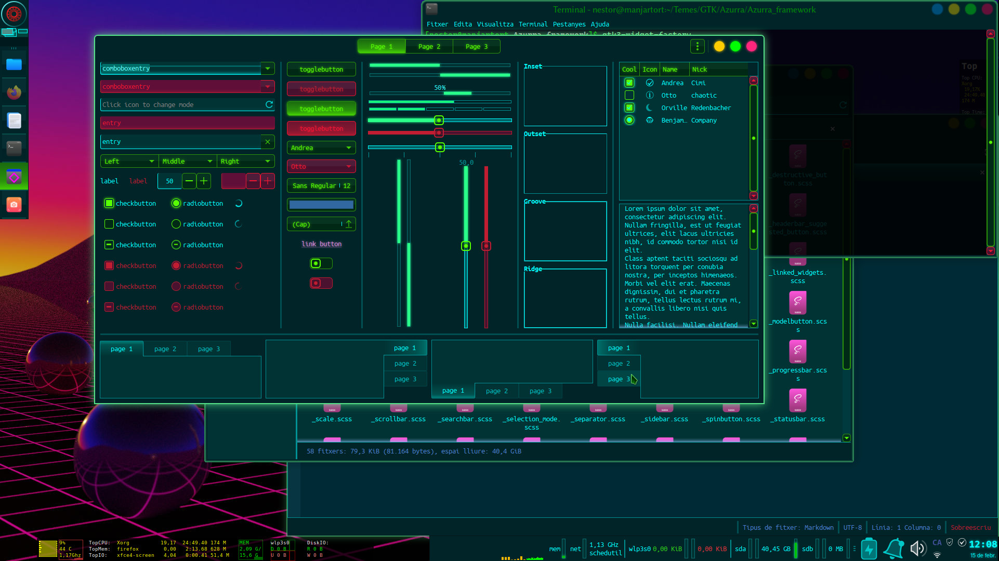
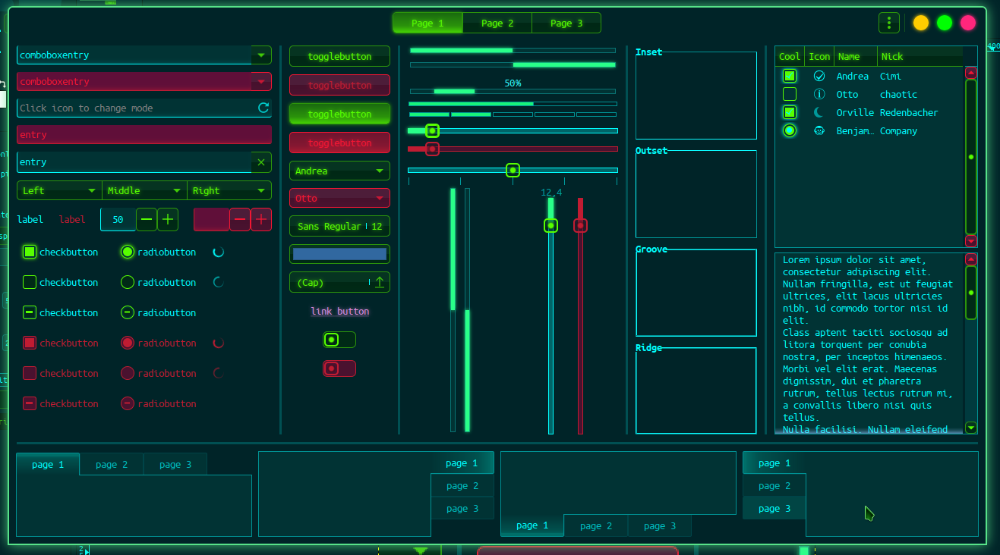
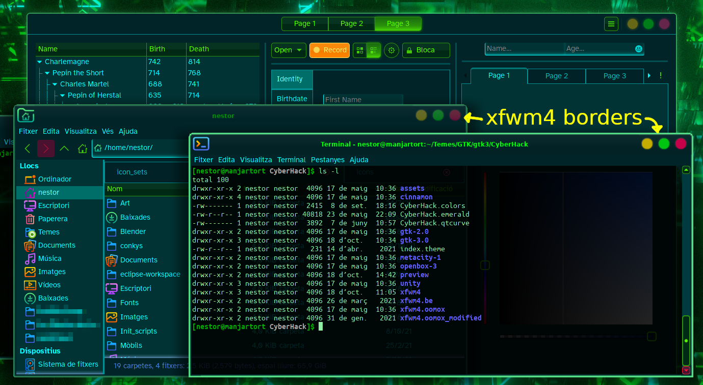

# CyberHack

CyberHack is a GTK2, GTK3, xfwm4, Cinnamon, Emerald, qtCurve and Color Scheme for GNU/Linux desktops.
It's hacker-looking, futuristic, cyberpunkish and glowing. Its main colors are cyan and green, and is a dark theme too.

There are also some files useful for other environments, which need to be installed or configured manually:

- CyberHack.colors: KDE Plasma Color scheme, needs to be imported from Plasma Color Scheme chooser.
- CyberHack.emerald: Emerald theme if you use Compiz with Emerald (old Beryl) decorator. You may import it with Emerald application.
- CyberHack.qtcurve: QtCurve configuration so it looks great with this theme. If you use KDE Plasma, you can import the file with Qturve configuration. If not, copy its contents to the file `~/.config/qtcurve/stylerc`
- CyberHack-qt5ct_colors.conf: This is a color scheme fot Qt5ct, a utility to configure the aspect of Qt applications for environments other than KDE Plasma. To use it, you need to copy it to your `~/.config/.qt5ct/colors` directory.

Kora icon theme is recommended.

